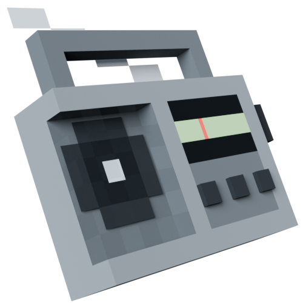

# Tanner Limes's Radio

Play radio channels with this player head avatar! 

Equip the avatar (make sure you're on max permissions), then place your player head in the world. Punch the radio to make it work! Sneak-punch to turn off the radio. 

<!-- ↓ Demo video ↓ -->
https://github.com/charliemikels/FiguraRadio/assets/20339866/605baed7-93d1-4f0e-8a00-d98c59d588cd

This script levarage `world:getTime()` and `math.randomseed` to stay in sync without using pings. You and your friends can listen to the radio together! (Due to lag and delays, they stay in sync about 90% of the time.)

If the host is online, additional brodcasts can be sent to clients through the files api and pings. 

Created for the June 2024 Figura avatar contest. 

## Adding brodcasts

You can add brodcasts in two ways, but both ways require you to put the durration of the track in the filename with the format `filename-##s.ogg`, where "filename" can be anything and "##" is the durration of the track in seconds. The `-`, and `s.ogg` are required. The converter scripts in the `Default_brodcasts` folder will convert, crush, and rename the files for you. You'll need FFMPEG and Bash installed to use them. 

1. Add them to the `Default_Brodcasts` folder. This makes them part of the avatar, and as such, will count against the upload limit. 
2. Add them to `[figura_root]/data/Additional_Radio_Brodcasts` (This script should make this folder for you if it doesn't exist). Brodcasts stored this way don't count against your upload limit, but there are a few additional restrictions. 
    1. There can't be more than 255 additional brodcasts
    2. The track must fit into 255 packets. (The packet size is set by `max_packet_size` in the pings section of the script. It's set to 500 bytes, so tracks less than 125kb in size should™ work fine)

This repo includes a few example brodcasts that fill these requirements. (Shout out to [Kevin MacLeod](incompetech.com) for making a bunch of royalty free music. See the `credits.txt` file for more detailed info.) 
